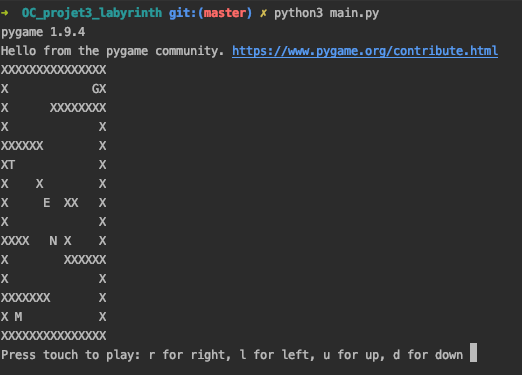
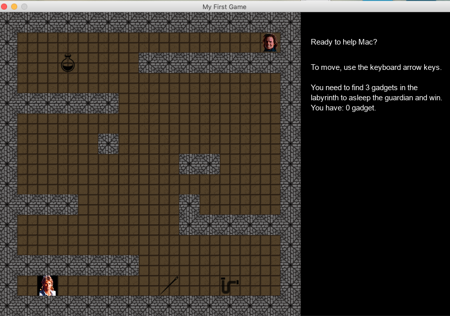

# OC_projet3_labyrinth

This project is a game and the first project I achieved in python.

## Getting Started

Clone the repo:
``` https://github.com/dibattista/OC_projet3_labyrinth.git ```

Get the requirement file:
``` pip3 install -r requirements.txt```

Start play in terminal :
``` python3 main.py```

Start play in pygame mode :
``` python3 main.py -g ```

## Rules 

To move in terminal:
`r: to turn right ` ` l to turn left` ` u to move up`
d to move down`

In graphic mode: 
```Use the arrow of the keyboard.```

If you want to quit the game: `
```click on the red cross in the left corner.``

To catch the Object in terminal mode:
``` pass on the letter N or T or E```

To catch the Object in graphic mode:
``` pass on the Object```

To modify the labyrinth:
Open the labyrinth.txt and change the wall inside the labyrinth as you wish.

If you have all the three Objects you will win if not you will be dead.

To play again you need to close the game and start again.

The Objects will move every time you close the game.

## Terminal mode



## Graphic mode

