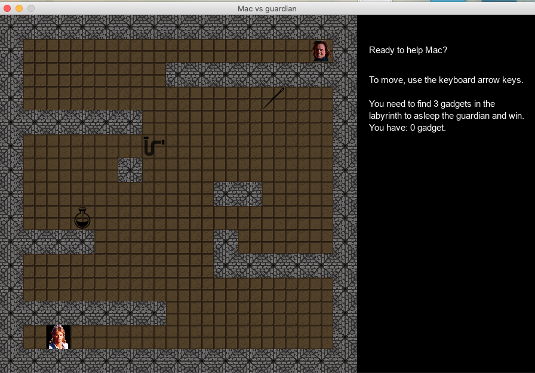

# OC_projet3_labyrinth

This project is a game and the first project I achieved in python.

## Getting Started

Clone the repo:
``` https://github.com/dibattista/OC_projet3_labyrinth.git ```

Get the requirement file:
``` pip3 install -r requirements.txt```

Start play in terminal :
``` python3 main.py```

Start play in pygame mode :
``` python3 main.py -g ```

## Rules 

To move in terminal:
`r: to turn right ` ` l to turn left` ` u to move up`
d to move down`

To move in graphic mode: 
```Use the arrow of the keyboard.```

If you want to quit the game:
```click on the red cross in the left corner.```

To catch the tools in terminal mode:
``` pass on the letter N or T or E```

To catch the tools in graphic mode:
``` pass on the tool```

To modify the labyrinth:

``` Open the labyrinth.txt```.

``` Add or remove the 'X' to change the position of the wall in the labyrinth```

```Move the 'M' to change the position of the player```

```Move the 'G' to change the position of the player```

If you have all the three tools you will win if not you will be dead.

To play again you need to close the game and start again.

The tools will move every time you close the game.

## Terminal mode


## Graphic mode

